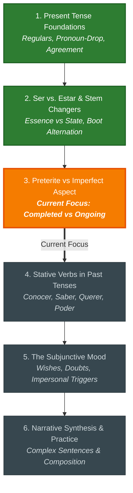

# 🧭 Spanish Grammar: Study Hub & Dashboard

Welcome to your study dashboard. This space organizes your syllabus, visual concept maps, and interactive practice exercises.

---

## 📊 Topic Progress

```
Present Tense Foundations       [████████████████████] Mastered
Ser vs. Estar & Stem Changers   [████████████████████] Mastered
Preterite vs. Imperfect Aspect  [████████████░░░░░░░░] Current Focus
Stative Past Nuances            [░░░░░░░░░░░░░░░░░░░░] Next Up
Subjunctive Mood                [░░░░░░░░░░░░░░░░░░░░] Queued
Narrative Synthesis             [░░░░░░░░░░░░░░░░░░░░] Queued
```

---

## 🗺️ Study Roadmap



---

## 🗂️ Study Units

Click any unit below to open the lesson, concept diagrams, and practice drills:

- [[01_CURRICULUM_ROADMAP|Full Study Roadmap & Timeline Visuals]]
- [[02_BOUNDARY_CALIBRATION|Placement Summary & Assessment Notes]]
- [[03_STUDENT_OBSIDIAN_SCRATCHPAD|My Study Notes & Questions]] 📝 *(Auto-synced with terminal sessions)*
- [[modules/M01_Present_Tense_Foundations|Unit 1: Present Tense Foundations]] *(Mastered)*
- [[modules/M02_Irregular_Verbs_Stem_Changers|Unit 2: Ser vs. Estar & Stem Changers]] *(Mastered)*
- [[modules/M03_Preterite_vs_Imperfect_Frontier|Unit 3: Preterite vs. Imperfect Aspect]] *(Current Topic)*
- [[modules/M04_Subjunctive_Mood_Advanced|Unit 4: The Subjunctive Mood]] *(Upcoming)*
- [[modules/M05_Comprehensive_Synthesis_Transfer|Unit 5: Narrative Composition & Practice]] *(Final Unit)*

---

## 💡 How to Study

1. **Review Notes in Obsidian:** Explore the visual diagrams and practice flashcards in each unit.
2. **Jot Down Questions:** Write any doubts in [[03_STUDENT_OBSIDIAN_SCRATCHPAD|My Study Notes & Questions]].
3. **Practice in the Terminal:** Run `./learn/learn chat` to work through exercises with your tutor. Any notes you wrote in Obsidian will be automatically brought up during your session.
