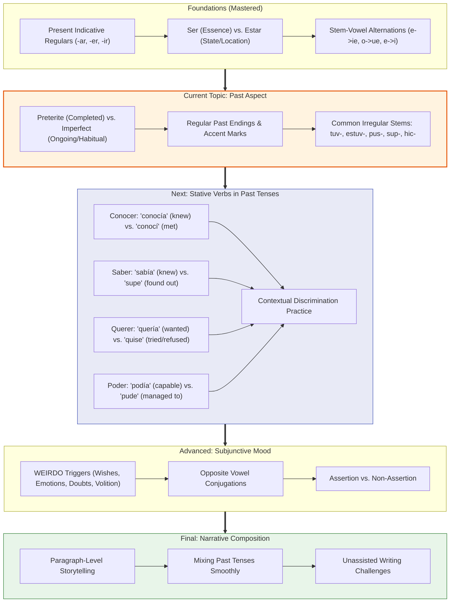

# 🗺️ Spanish Grammar Study Roadmap

A structured learning progression from foundational grammar to advanced narrative fluency, based on the course materials in `learn/material/spanish/spanish_textbook.pdf`.

---

## 🧭 Topic Sequence



---

## 📐 The Geometry of Past Aspect

A helpful visual way to distinguish the two Spanish past tenses:

```
                       THE GEOMETRY OF PAST TENSES
                       ===========================

  PRETERITE (Completed Event)
  ---------------------------
  An action viewed from the OUTSIDE as a finished whole with clear boundaries:
  
         [ Start •====================• End ]
           t1                               t2
     "Ayer hablé con María." (Finished, bounded event)


  IMPERFECT (Ongoing Background / Habit)
  --------------------------------------
  An action viewed from the INSIDE as an ongoing or habitual backdrop:
  
  ... ~ ~ ~ ~ ~ ~ ~ ~ ~ ~ [ MOMENT IN TIME ] ~ ~ ~ ~ ~ ~ ~ ~ ~ ...
                          "Mientras yo leía..."
     (Ongoing stream; boundaries are not the focus)


  COMBINED: An Action Interrupted
  ------------------------------
  The imperfect creates the background; the preterite steps in:

  IMPERFECT (Background):  ══════════════════════════════════════════>
                           "Yo caminaba por el parque..."
                                         ▲
                                         │ (Punctual event)
  PRETERITE (Interruption):        [ ! ME CAÍ ! ]
                                   "cuando me caí."
```

---

## ⚡ Self-Check Milestones

- [x] Conjugate regular -ar, -er, -ir verbs in the present tense without needing pronouns.
- [x] Distinguish *ser listo* (smart) from *estar listo* (ready).
- [ ] Conjugate irregular preterite stems (*tener -> tuve*, *poner -> puse*).
- [ ] Choose between preterite and imperfect when describing an action that interrupts an ongoing activity.
- [ ] Explain the difference between *no quise ir* and *no quería ir*.
- [ ] Form the present subjunctive for irregular verbs (*hacer -> haga*, *tener -> tenga*).
