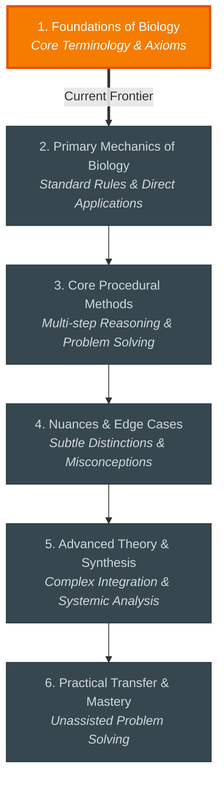

# 🗺️ Biology Study Roadmap

A structured learning progression from foundational concepts to advanced independent mastery.

---

## 🧭 Topic Sequence



---

## 📊 Progress Overview

```
1. Foundations of Biology        [██████████░░░░░░░░░░] Current Focus
2. Primary Mechanics of Biolog   [░░░░░░░░░░░░░░░░░░░░] Next Up
3. Core Procedural Methods       [░░░░░░░░░░░░░░░░░░░░] Queued
4. Nuances & Edge Cases          [░░░░░░░░░░░░░░░░░░░░] Queued
5. Advanced Theory & Synthesis   [░░░░░░░░░░░░░░░░░░░░] Queued
6. Practical Transfer & Master   [░░░░░░░░░░░░░░░░░░░░] Queued
```
