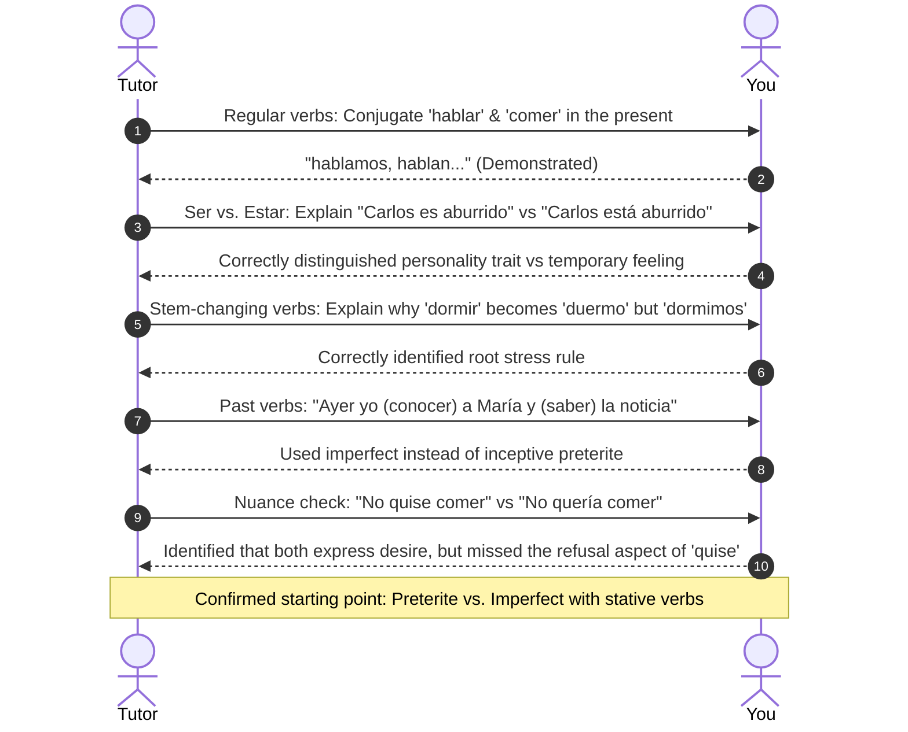

# 📋 Placement & Diagnostic Summary

This document records your initial placement check and tracks the concepts you have demonstrated mastery in.

---

## 📈 Placement Review

---

## 🔍 Topics Assessed

### 1. Regular Present Conjugations & Pronoun Usage
- **Result:** Mastered. You correctly applied conjugation endings and noted that subject pronouns are optional because endings indicate the person.

### 2. Ser vs. Estar
- **Result:** Mastered. You clearly distinguished between inherent characteristics (*ser*) and temporary states (*estar*).

### 3. Stem-Changing Verbs
- **Result:** Mastered. You understood how stress on the root vowel triggers the $o \rightarrow ue$ diphthong in singular forms while plural forms retain the unstressed root.

### 4. Past Tense with Stative Verbs (*conocer, saber, querer, poder*)
- **Result:** **Current Focus Area.** In English, verbs like "knew" or "wanted" often cover both prolonged feelings and sudden events. In Spanish, putting these verbs in the preterite marks the exact moment a state began (e.g. *supe* = "I found out", *conocí* = "I met", *no quise* = "I refused").

---

## 🎯 Current Target
Focus on mastering the meaning changes that occur when stative verbs are used in the preterite vs. imperfect.
See [[modules/M03_Preterite_vs_Imperfect_Frontier|Unit 3: Preterite vs. Imperfect]] for lesson notes and practice exercises.
