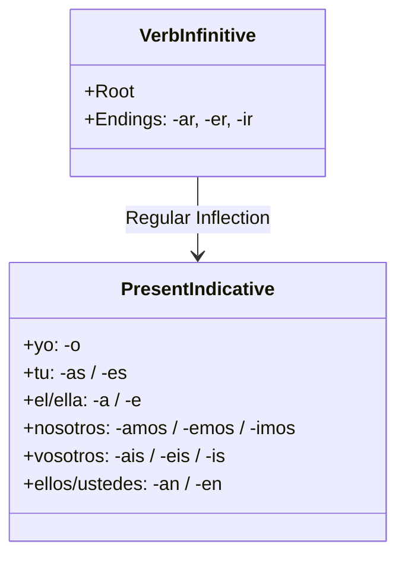

# Unit 01: Present Tense Foundations

Regular verb conjugations, pronoun-drop rules, and grammatical agreement in Spanish.

---

## 🗺️ Conjugation Patterns

---

## ⚡ Self-Check Drill

> [!QUESTION] Quick Recall
> Why is it completely natural to omit *"yo"* in *"Hablo español"*?
> 

> 
👁️ Click to check

> Spanish is a <strong>null-subject</strong> language. The ending <em>-o</em> already indicates first-person singular. Pronouns like <em>yo</em> are usually reserved for emphasis or contrast.
> 

---

## 📝 My Notes
- Mastered in initial check.
