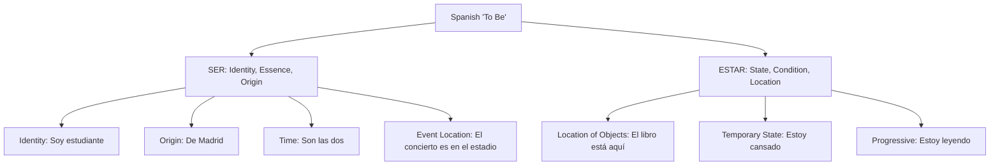

# Unit 02: Ser vs. Estar & Stem-Changing Verbs

Understanding the core distinction between identity and states, and mastering vowel shifts in "boot" verbs.

---

## 📐 Ser vs. Estar Overview



---

## 👞 The "Boot" Verb Pattern

```
                  THE BOOT PATTERN (Vowel Alternation)
                  ====================================
                  Example: DORMIR (o -> ue)
                  
                  [ yo DUERMO ]         [ nosotros dormimos ]
                  [ tú DUERMES ]        [ vosotros dormís   ]
                  [ él DUERME  ]
                  ----------------
                  [ ellos DUERMEN ]
                  
     *Inside the boot (singular forms + 3rd person plural): root is stressed -> 'ue'
     *Outside the boot (nosotros / vosotros): root is unstressed -> remains 'o'
```

---

## 📝 My Notes
- Mastered in initial check.
