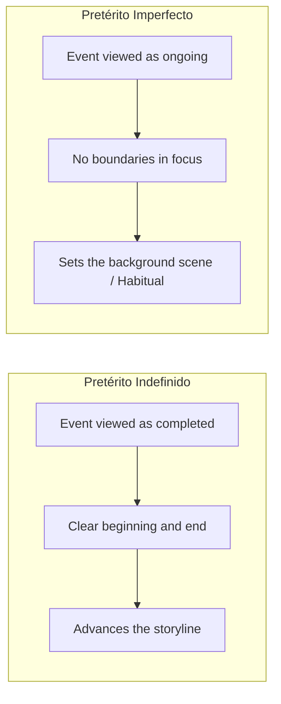

# Unit 03: Preterite vs. Imperfect Aspect

Mastering the difference between completed past actions and ongoing background descriptions, and understanding the meaning shifts that occur with stative verbs.

> [!TIP]
> Try to answer each practice question on your own before clicking to reveal the answer!

---

## 🧭 Visualizing the Two Past Tenses

In Spanish, choosing between the preterite and imperfect comes down to **how you view the event**:



```
   AN INTERRUPTED ACTION IN THE PAST
   =================================

   IMPERFECT (The Background Scene):
   ───────────────────────────────────────────────────────────>
   "Yo caminaba tranquilamente..." (Ongoing activity)

                             ▲
                             │ (Sudden event)
   PRETERITE (The Interruption):
                       [ ! ME CAÍ ! ]
                       "de repente me caí." (Single, completed action)
```

---

## ⚡ Stative Verbs: Meaning Shifts in the Past

Stative verbs describe feelings, mental states, or knowledge. When you put them in the **Preterite**, they often shift from an ongoing state into a **single, specific moment** (the exact moment the state started or was acted upon):

```
+------------+-----------------------------------+-----------------------------------+
| Verb       | Imperfect (Ongoing State)         | Preterite (Specific Moment)       |
+------------+-----------------------------------+-----------------------------------+
| CONOCER    | conocía = was acquainted with     | conocí = met for the first time   |
| SABER      | sabía = possessed knowledge       | supe = found out / discovered     |
| QUERER     | quería = felt like / wanted to    | quise = attempted / tried         |
| NO QUERER  | no quería = didn't feel like it   | no quise = refused outright       |
| PODER      | podía = had the ability to        | pude = managed / succeeded in     |
| NO PODER   | no podía = was unable in general  | no pude = tried and failed        |
| HABER      | había = existed (scene/setting)   | hubo = took place / occurred      |
+------------+-----------------------------------+-----------------------------------+
```

---

## 🧩 Step-by-Step Examples

### Example 1: Meeting Someone
- **English:** "Yesterday I met your sister at the museum."
- **Explanation:** Meeting someone is a specific, single event (the start of acquaintance), not an ongoing state. Use the preterite:
- **Spanish:** *Ayer conocí a tu hermana en el museo.*

### Example 2: Finding Out News
- **English:** "We knew the exam was hard [sabíamos], but yesterday we found out [___] that it was cancelled."
- **Explanation:** "Finding out" is the exact moment knowledge arrived:
- **Spanish:** *...ayer nosotros supimos que se canceló.*

### Example 3: Trying and Failing
- **English:** "She tried to open the window, but she couldn't."
- **Spanish:** *Ella quiso abrir la ventana, pero no pudo.*
- **Explanation:** *Quiso* indicates the active attempt; *no pudo* indicates the failure of that specific attempt.

### Example 4: Descriptive Existence vs. Event Occurrence (*haber*)
- **English:** "There were many people at the concert [había], and suddenly there was an explosion [hubo]."
- **Spanish:** *Había mucha gente en el concierto y de repente hubo una explosión.*
- **Explanation:** *Había* provides background setting / descriptive existence without bounds. *Hubo* denotes an event that took place / occurred at a defined point in time.

---

## 🗂️ Quick Retrieval Drills

> [!QUESTION] Practice 1
> How would you translate: *"At that very second, the detective discovered who the killer was."*?
> <details>
> <summary>👁️ Click to check your answer</summary>
> <strong>En ese mismo segundo, el detective supo quién era el asesino.</strong><br/>
> <em>Explanation:</em> The phrase <em>"en ese mismo segundo"</em> marks a precise moment in time, requiring the preterite <em>supo</em> (discovered).
> </details>

> [!QUESTION] Practice 2
> What is the difference between these two statements?
> 1. <em>Juan no quería firmar el contrato.</em>
> 2. <em>Juan no quiso firmar el contrato.</em>
> <details>
> <summary>👁️ Click to check your answer</summary>
> In (1) <em>no quería</em> describes his attitude (he was reluctant / didn't feel like signing).<br/>
> In (2) <em>no quiso</em> describes an active refusal (he refused to sign).
> </details>

---

## 📝 My Notes on This Unit

- Note:
