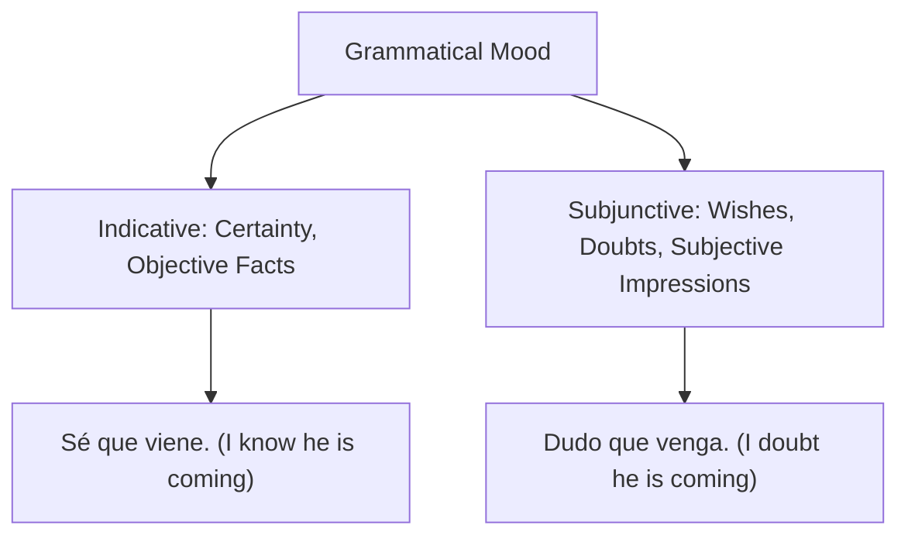

# Unit 04: The Subjunctive Mood

Understanding when to express assertions vs. non-assertions, and mastering the opposite vowel conjugation pattern.

---

## 🌌 Indicative vs. Subjunctive



---

## 🔑 Common Triggers (The WEIRDO Framework)

```
   W - Wishes / Desires      : Quiero que... / Deseo que...
   E - Emotions              : Me alegro de que... / Temo que...
   I - Impersonal Expressions: Es necesario que... / Es bueno que...
   R - Recommendations       : Sugiero que... / Recomiendo que...
   D - Doubt / Denial        : Dudo que... / No creo que...
   O - Ojalá                 : ¡Ojalá que haga sol!
```

---

## ⚙️ How to Form the Present Subjunctive

```
  Step 1: Start with the 'yo' form in the present indicative:
          tener -> tengo
  Step 2: Drop the '-o':
          teng-
  Step 3: Add the opposite vowel ending:
          -ar verbs take -e: hable, hables, hable, hablemos...
          -er/-ir verbs take -a: tenga, tengas, tenga, tengamos...
```

---

## 📝 My Notes
- Scheduled after mastering Unit 03.
