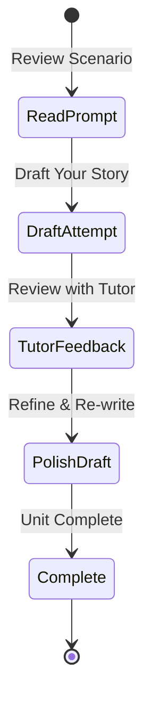

# Unit 05: Narrative Composition & Practice

Putting together mixed past tenses, ser vs. estar, and the subjunctive mood in extended Spanish composition.

---

## 🔄 Writing Progression

---

## 📝 Practice Writing Challenge

Write a short paragraph (5–8 sentences) in Spanish describing an unexpected event in the past that incorporates:
1. An ongoing action interrupted by a sudden realization (*saber* in the preterite).
2. A character attempting or refusing an action (*querer* in the preterite).
3. A character expressing doubt or a wish (*dudar que* + subjunctive).

Check off when you've practiced this in the terminal:
- [ ] Drafted paragraph
- [ ] Reviewed with tutor
